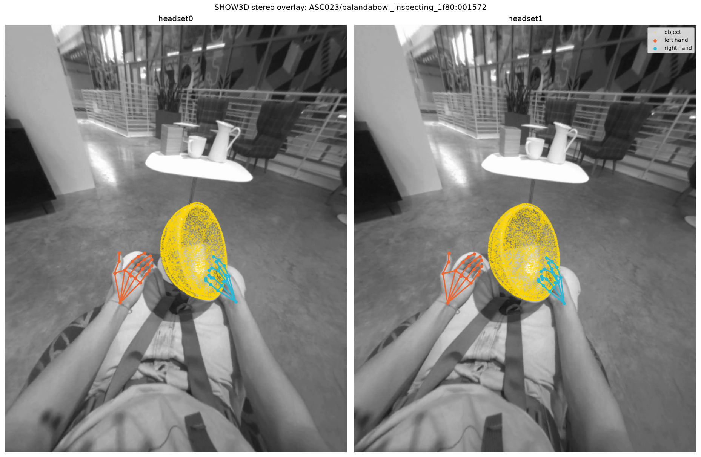
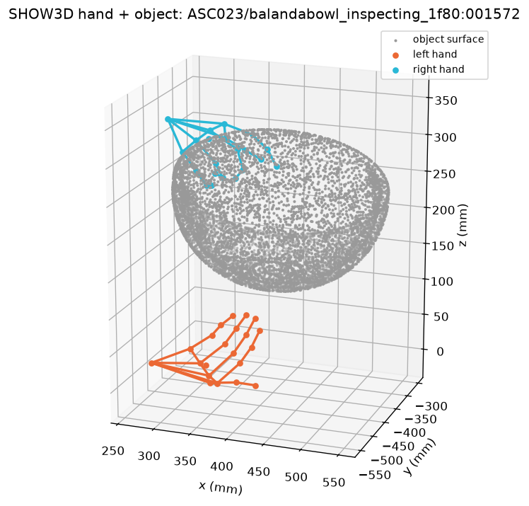
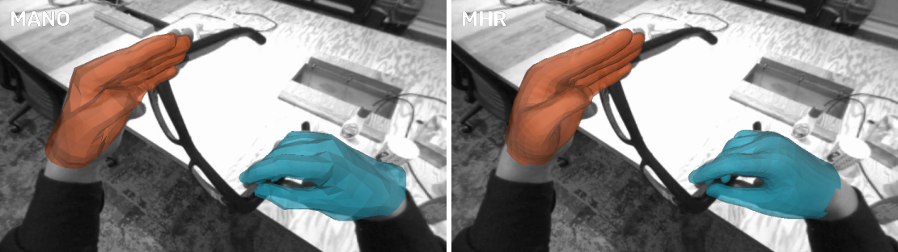

# SHOW3D

Python tools for [SHOW3D](https://huggingface.co/datasets/facebook/show3d-dataset),
a dataset of 3D hands and objects captured in the wild (CVPR 2026).

[Paper](https://arxiv.org/abs/2603.28760) |
[Dataset](https://huggingface.co/datasets/facebook/show3d-dataset) |
[Interaction Field Estimation Challenge](https://github.com/patrickqrim/SHOW3D-dataset-api/tree/main/show3d/interaction_field)



SHOW3D has 2,137 recordings of hands using objects in the wild, 20 hours in
total. Each recording has two egocentric views from a Meta Quest 3 headset at 60
fps, and up to eight exocentric views from a camera rig worn on the back. The
training scenes come with marker-less 3D hand poses, and a subset of them with
object poses too (the `has_object_pose` flag of the dataset index). The test
scenes' poses are held back.

With this package you can:

- load frames: video paths, camera calibration, hand poses and object poses
- draw hands and objects on a frame, or in 3D
- pose and draw hand meshes in three hand models: UmeTrack, MANO and MHR
- extract frames to images for fast training

The package covers the two egocentric views. The dataset card describes the
exocentric views, captions and depth.

## Install

```bash
git clone https://github.com/facebookresearch/show3d.git
cd show3d
pip install -r requirements.txt
```

The core needs only numpy and OpenCV. Drawing needs matplotlib. Hand meshes need
a few more packages; see [Render hand meshes](#render-hand-meshes).

## Try it without the data

This command draws a small synthetic scene, so you can check your install before
you download anything:

```bash
python -m show3d.demo_viz --out geometry.png
```

## Get the data

Download SHOW3D from Hugging Face:
[`facebook/show3d-dataset`](https://huggingface.co/datasets/facebook/show3d-dataset).
The code expects the released layout under one root folder:

```
<root>/
├── scenes/<subject>/<scene>/
│   ├── headset0.mp4, headset1.mp4              # egocentric videos
│   ├── camera_calibration/headset{0,1}.json   # intrinsics + per-frame pose
│   └── metadata/frame_info.json
├── object_pose/<version>/scenes/<subject>/<scene>/object_pose.json
└── hand_pose/
    ├── <version>/scenes/<subject>/<scene>/hand_pose_umetrack.json   # v1, v2: hand_pose.json
    └── hand_profiles/<subject>/profile_umetrack.json
```

From hand_pose v3 on, each scene also has `hand_pose_mano.json` and
`hand_pose_mhr.json`, and each subject has `profile_mano.json` and
`profile_mhr.json`.

A scene ID has the form `<object>_<action>_<hash>`, for example
`bbq_cleaning-the-outside_277b`. The part before the first underscore names the
object.

## Load frames

`Show3DDataset` takes a root folder and a list of frames. Each item holds one
frame's video paths, calibration, hand poses and object pose:

```python
from show3d.dataset import Show3DDataset, Show3DFrameRef

frames = [Show3DFrameRef("ISH822", "aria_inspecting_3ab0", i) for i in range(0, 600, 60)]
dataset = Show3DDataset("/path/to/show3d", frames)

frame = dataset[0]
frame.left_hand           # confidence and (21, 3) landmarks_world_mm, or None
frame.object_pose         # confidence, rotation and translation_mm, or None
frame.views["headset0"]   # video_path and calibration (intrinsics, world-from-camera)
```

Positions are in millimeters, in the world frame of the scene's calibration. This
world frame is the frame of the back-mounted rig, so it moves with the person. See
the dataset card for details.

The loader reads hand_pose v2 and object_pose v1 by default. Pass
`hand_pose_version` or `object_pose_version` to pick another release. It returns
paths only. Pass `decode_images=True` to also decode each frame with OpenCV.

You can also keep a list of frames in a manifest: a JSONL file with one
`{"subject_id", "scene_id", "frame_index"}` object per line. Load it with
`Show3DDataset.from_manifest_jsonl(root, path)`, and write one with
`write_frame_manifest_jsonl`.

### Headset pose validity

Use a frame's headset pose only when `frame.headset_pose_valid` is true.

- **Calibration files with `pose_contract_version` 1** carry `is_pose_valid` and
  `pose_source` (`mocap`, `vio`, `endpoint_interpolation`,
  `smooth_mocap_interpolation` or `legacy_unspecified`) per frame. The loader
  returns `t_world_from_camera` only when `is_pose_valid` is true.
- **Older calibration files** have only `is_synthesized`, which is true when
  interpolation produced the pose. The loader returns `t_world_from_camera` only
  when `is_synthesized` is false.

Pin the data and code revisions together to keep the same set of valid frames.

## Visualize a frame

`show3d.demo_viz` draws one frame of a manifest:

```bash
python -m show3d.demo_viz --root /path/to/show3d --manifest frames.jsonl \
    --mode overlay --view stereo --out overlay.png
python -m show3d.demo_viz --root /path/to/show3d --manifest frames.jsonl \
    --mode geometry --out geometry.png
```

It picks the first frame with a valid headset pose and a confident hand. The
`overlay` mode projects the hand skeletons and object onto one egocentric image
(`--view headset0` or `headset1`), or onto both side by side with
`--view stereo`, as in the image at the top. Left hands are orange and right
hands cyan in every render, hand meshes included. The `geometry` mode draws them
in 3D:



The drawing functions live in `show3d.viz` and the camera projection in
`show3d.camera`.

## Render hand meshes

From hand_pose v3 on, every hand-frame with world geometry comes in three hand
models: UmeTrack (the native solve), MANO and MHR. `show3d.hand_mesh` poses each
of them in the scene's world frame, and `demo_viz --model` draws the meshes on a
headset frame, or on a frame range with `--video`:

```bash
python -m show3d.demo_viz --root /path/to/show3d --scene ISH822/aria_inspecting_3ab0 \
    --model umetrack --frame 600 --out umetrack.png
python -m show3d.demo_viz --root /path/to/show3d --scene ISH822/aria_inspecting_3ab0 \
    --model mano --asset-dir /path/to/mano/models --frame 600 --out mano.png
python -m show3d.demo_viz --root /path/to/show3d --scene ISH822/aria_inspecting_3ab0 \
    --model mhr --asset-dir /path/to/mhr/assets --video --num-frames 300 --out mhr.mp4
```

Frame 600 of that scene, cropped to the hands, in MANO and MHR (left hand
orange, right hand cyan):



Each model needs its own packages and files, which `requirements.txt` leaves
out. pymomentum-cpu needs Python 3.12 or 3.13.

- **UmeTrack:** `pip install torch projectaria-tools`, and put the `hot3d/`
  folder of [HOT3D](https://github.com/facebookresearch/hot3d) on `PYTHONPATH`.
  HOT3D's UmeTrack loader poses the mesh. hand_pose v2 works too, with
  `--hand-pose-version v2`.
- **MANO:** `pip install torch smplx`, with `MANO_LEFT.pkl` and `MANO_RIGHT.pkl`
  from [MANO](https://mano.is.tue.mpg.de) in the `--asset-dir` folder. smplx
  loads them without chumpy only after their chumpy objects are removed with
  smplx's `tools/clean_ch.py`, which runs under Python 2 with chumpy installed.
- **MHR:** `pip install torch mhr pymomentum-cpu`, with the asset folder of
  [MHR](https://github.com/facebookresearch/MHR) as `--asset-dir`.

The same meshes from Python, as world-frame vertices in mm with their faces:

```python
from show3d.hand_mesh import HandMeshScene, RIGHT_SLOT

scene = HandMeshScene("/path/to/show3d", "ISH822", "aria_inspecting_3ab0", "mano",
                      asset_dir="/path/to/mano/models")
mesh = scene.mesh(600, RIGHT_SLOT)
```

`mesh` is None when the hand is missing, its confidence is 0.1 (the accept gate)
or lower, or, for UmeTrack, the frame has no world geometry. Pass
`confidence_threshold=0.5` for the high-confidence gate.

## Extract frames for training

Seeking to random frames in an MP4 is slow, so training straight from the videos
spends most of its time decoding. `show3d.extract_images` decodes each video once,
keeps the frames at the rate you choose, and writes them as images:

```bash
python -m show3d.extract_images --root /path/to/show3d --out frames/ --fps 10
```

- `--fps` is required. It must divide the 60 fps source evenly: 1, 2, 3, 4, 5, 6,
  10, 12, 15, 20, 30 or 60.
- `--manifest` limits the run to the scenes a manifest names. Without it,
  `--require-object-pose` keeps only the scenes with object poses.
  `--posed-only` also drops frames without a confident object pose.
- `--views headset0`, `--format png`, `--quality 80` and `--workers 16` set the
  views, image format, JPEG quality and parallelism.

The output has one image per frame and view, plus `index.jsonl` with one row per
image. Each row's `sample_id` (`SUBJECT/SCENE:FRAME`) is the same for both views
of a frame, so you can join per-frame labels to the images on it.

## Interaction Field Estimation Challenge

The Interaction Field Estimation Challenge at the HANDS workshop, ECCV 2026, asks
for a 3D vector from each hand joint to the nearest point on the object, in every
frame. Its starter kit builds on this package and lives in
[patrickqrim/SHOW3D-dataset-api](https://github.com/patrickqrim/SHOW3D-dataset-api/tree/main/show3d/interaction_field),
with the task, a baseline, and the submission and evaluation tools.

## Repository layout

```
show3d/
├── dataset.py            # dataset loader, paths and pose parsing
├── camera.py             # pinhole projection
├── viz.py                # drawing: skeletons, objects, hand meshes
├── demo_viz.py           # visualization command line
├── hand_mesh.py          # posed hand meshes; one hand_mesh_<model>.py per model
├── extract_images.py     # extract frames to images at a chosen fps
├── synthetic.py          # a tiny synthetic scene for demos and tests
├── assets/objects/       # object meshes (.glb, from HOT3D)
└── tests/                # unit tests
```

Run the tests with:

```bash
python -m unittest discover
```

## License

The code and the bundled object meshes are released under Creative Commons
Attribution-NonCommercial 4.0 International (CC BY-NC 4.0); see `LICENSE`. The
meshes come from the HOT3D object models (BOP HOT3D release,
`object_models_eval`); see `show3d/assets/objects/ATTRIBUTION.md`.

## Citation

If you use SHOW3D, please cite:

```bibtex
@InProceedings{Rim_2026_CVPR,
    author    = {Rim, Patrick and Harris, Kevin and Copple, Braden and Han, Shangchen and Xie, Xu and Shugurov, Ivan and An, Sizhe and Wen, He and Wong, Alex and Hodan, Tomas and He, Kun},
    title     = {SHOW3D: Capturing Scenes of 3D Hands and Objects in the Wild},
    booktitle = {Proceedings of the IEEE/CVF Conference on Computer Vision and Pattern Recognition (CVPR)},
    month     = {June},
    year      = {2026},
    pages     = {7111-7120}
}
```
